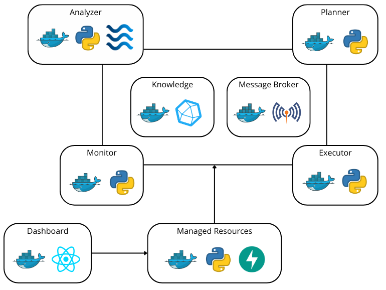
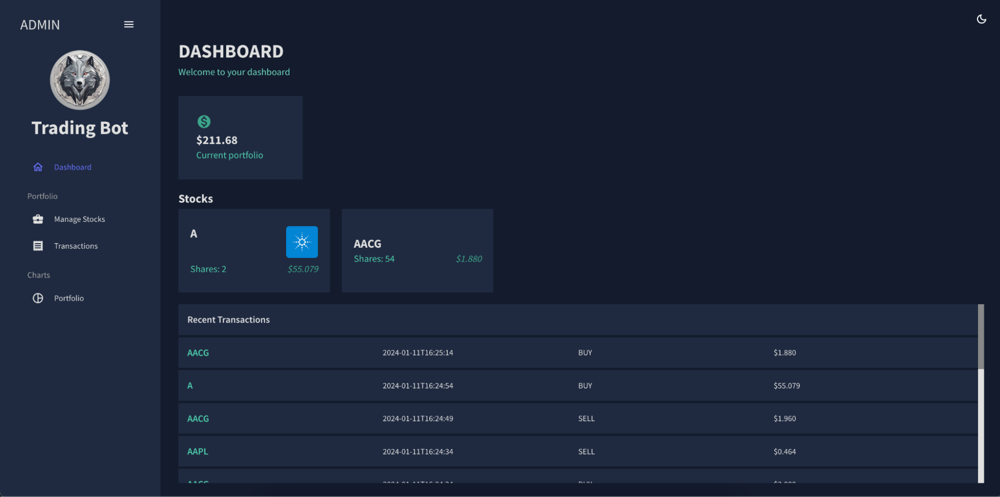
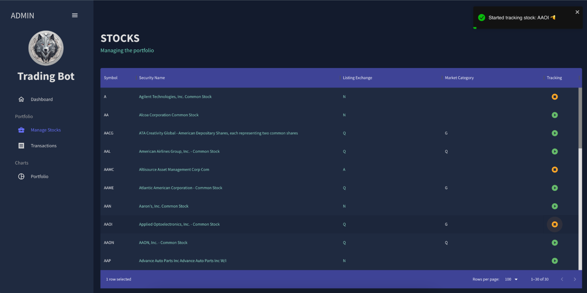
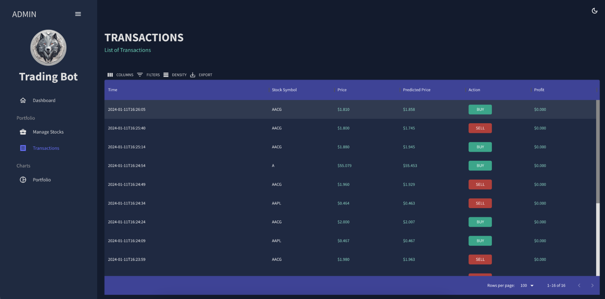
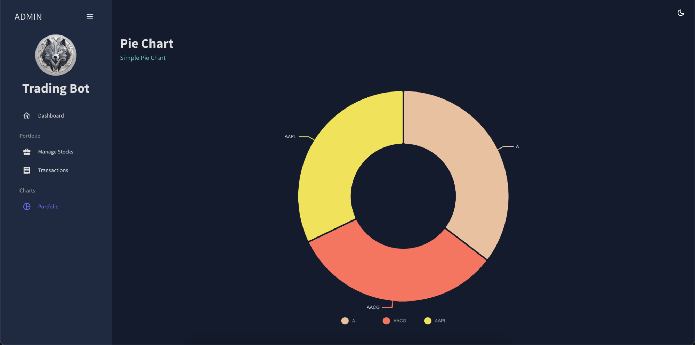

# The Bot of Wall Street

## About the Project


<!-- [![Logo][logo]]() -->
<p align="center">
  
</p>

The automated stock trading bot aims to optimise investment returns through autonomous decision-making. Key objectives include efficient buy/sell order execution, real-time adaptation to market conditions, and a user-friendly interface for monitoring and configuration. Managed resources encompass financial portfolios and historical market data. The system employs a MAPE-K feedback control loop, actively monitoring market data, analysing trends through machine learning, formulating trading plans, executing orders, and updating a knowledge base for continuous improvement.

Project developed for the Software Engineering for Autonomous System course - University of L'Aquila.


## System Architecture

<p align="center">
  
</p>

## Built with

[![React][React.js]][React-url][![MUI][MUI.com]][MUI-url][![Python][Python.org]][Python-url][![MQTT][MQTT.com]][MQTT-url][![Docker][Docker.com]][Docker-url][![FastAPI][FastAPI.com]][FastAPI-url][![InfluxDB][InfluxDB.com]][InfluxDB-url]

## Getting Started

### Prerequisites

Here are things you want to have on your computer beforehand.

* Docker

### Installation

_Below is an example of how you can instruct your audience on installing and setting up your app. This template doesn't rely on any external dependencies or services._

1. Clone the repo
   ```sh
   git clone https://github.com/ricardochavezt/the-bot-of-wall-street
   ```
2. Run the containers
   ```sh
   docker-compose up
   ```
3. Navigate to http://localhost:5001/, where you can see the following:

<p align="center">
  
  
  
  
</p>


## Configuration

The configuration of the system is mainly contained in the docker-compose.yml file. Be sure that all the exposed mapped ports are free on your environment:

* 5001 for the Dashboard
* 1883 and 9001 for Mosquitto MQTT Broker
* 8086 for InfluxDB
* 8000 for FastAPI

To interact with InfluxDB, navigate to http://localhost:8086/. Use the following credentials: username=admin, password=admin123.

## Developed by
* [Alex Montoya Franco](https://github.com/montoruwalkr)
* [Ricardo Chavez](https://github.com/ricardochavezt)
* [Sherkhan Azimov](https://github.com/azimovs)

<!-- MARKDOWN LINKS & IMAGES -->
[React.js]: https://img.shields.io/badge/React-20232A?style=for-the-badge&logo=react&logoColor=61DAFB
[React-url]: https://reactjs.org/
[Python.org]: https://img.shields.io/badge/python-3670A0?style=for-the-badge&logo=python&logoColor=ffdd54
[Python-url]: https://www.python.org/
[MUI.com]: https://img.shields.io/badge/MUI-%230081CB.svg?style=for-the-badge&logo=mui&logoColor=white
[MUI-url]: https://mui.com/
[MQTT.com]: https://camo.githubusercontent.com/7032ff43ba978eff463cbbd12e4f747102e73b3cd71bc626171e1e0487099432/68747470733a2f2f696d672e736869656c64732e696f2f7374617469632f76313f7374796c653d666f722d7468652d6261646765266d6573736167653d4d51545426636f6c6f723d363630303636266c6f676f3d4d515454266c6f676f436f6c6f723d464646464646266c6162656c3d
[MQTT-url]: https://mqtt.org/
[Docker.com]: https://img.shields.io/badge/docker-%230db7ed.svg?style=for-the-badge&logo=docker&logoColor=white
[Docker-url]: https://www.docker.com/
[FastAPI.com]: https://img.shields.io/badge/FastAPI-005571?style=for-the-badge&logo=fastapi
[FastAPI-url]: https://fastapi.tiangolo.com/
[InfluxDB.com]: https://img.shields.io/badge/InfluxDB-22ADF6?style=for-the-badge&logo=InfluxDB&logoColor=white
[InfluxDB-url]: https://www.influxdata.com/